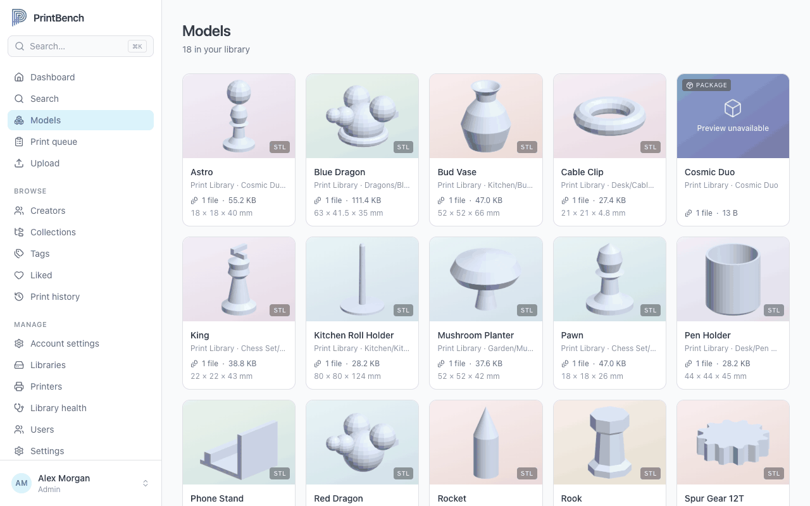
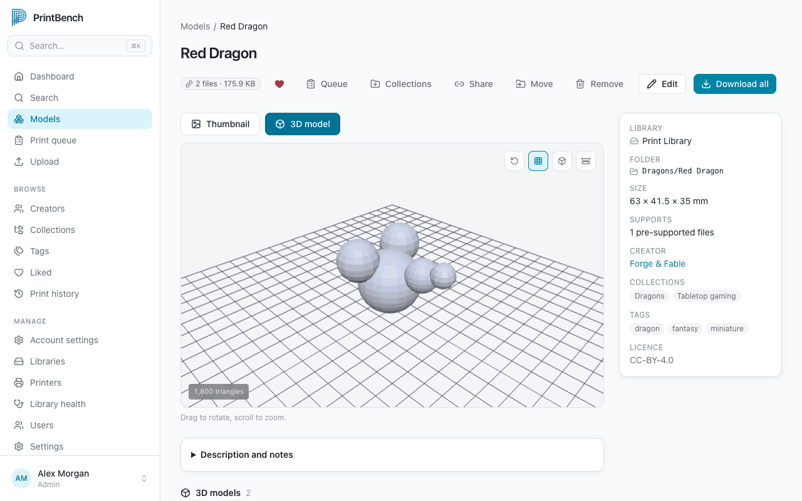
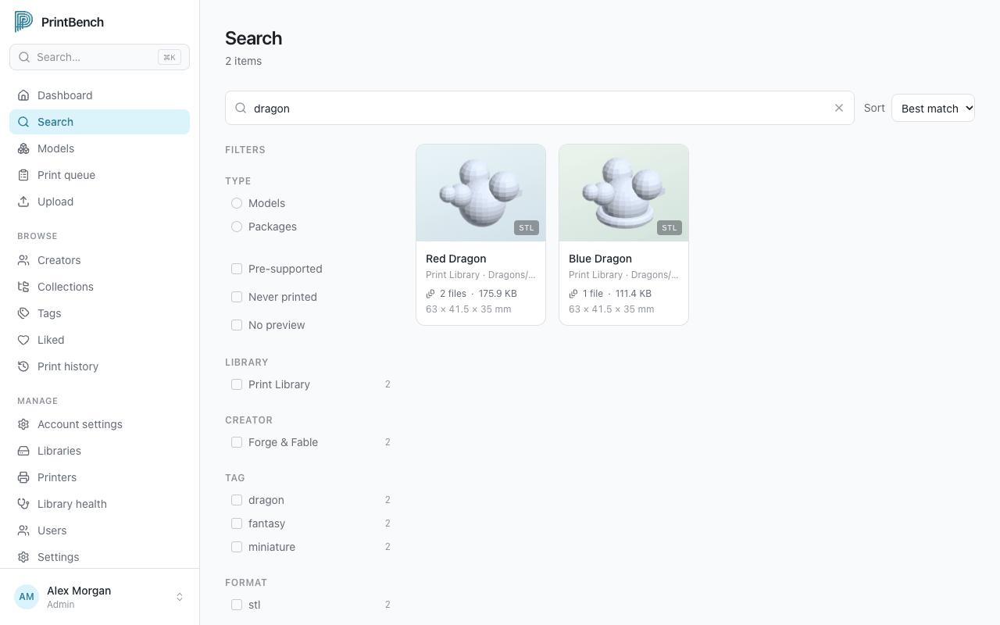
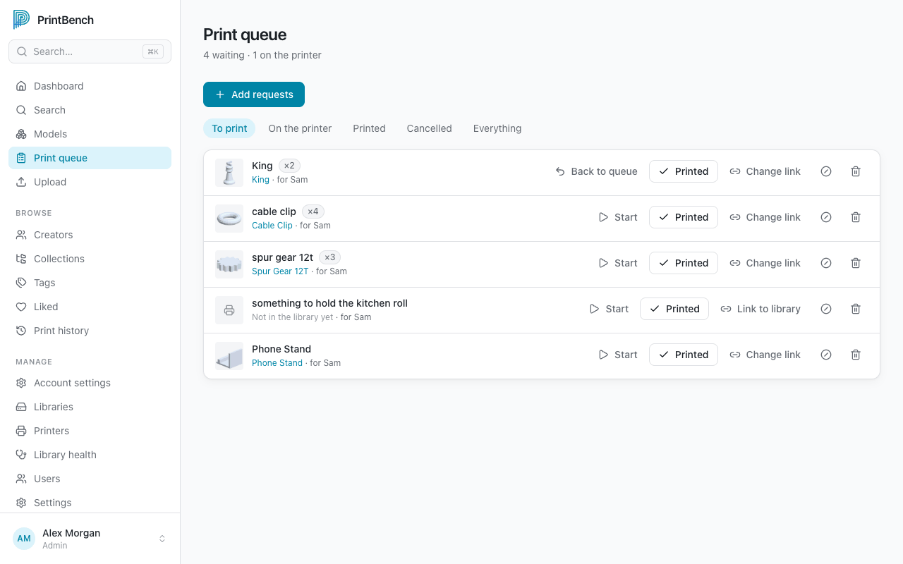
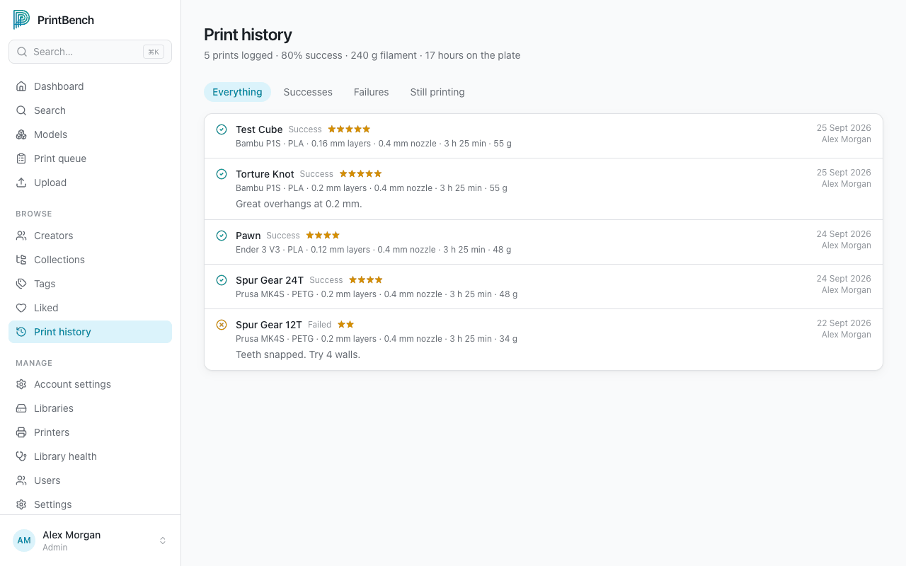

<p align="center">
  
</p>

<h1 align="center">PrintBench</h1>

<p align="center">
  Your 3D printing workspace.<br>
  A self-hosted library for the STL, 3MF, OBJ and PLY files you already have.
</p>

<p align="center">
  <a href="https://github.com/PrintBench/printbench/releases/latest"></a>
  <a href="LICENSE"></a>
  
  
</p>

<p align="center">
  
</p>

Point PrintBench at a folder of print files and it turns them into a searchable, visual library: thumbnails, 3D previews, tags, creators, collections, print history and a print queue. It never moves, renames or deletes your files.

Postgres is the **only** thing it needs. No Redis, no message broker, no Elasticsearch, and no native 3D toolchain to install.

## Features

- **Finds your models for you.** Folders become models, with thumbnails rendered for STL, 3MF, OBJ and PLY. Even a 6 GB STL renders without trouble.
- **Fast search that forgives typos.** Filter by tag, creator, licence, format or "never printed". Searches are plain URLs you can bookmark and share.
- **Preview in 3D** right in the browser.
- **Organise your way** with tags (and tag merge), creators, nested collections and a private Liked list.
- **Know your filament stock.** Manage individual spools, weigh remaining filament, and track multi-spool print consumption and costs.
- **Keep a print log.** Record printer, material, settings, rating and notes, and see a success rate per model.
- **A print queue for the household.** Paste a list of things people asked for, one per line, and PrintBench links the ones it recognises.
- **Hand files to your slicer.** Open in Bambu Studio, Creality Print, OrcaSlicer, PrusaSlicer, Cura or Lychee, and send sliced files to OctoPrint, Moonraker or PrusaLink printers.
- **Import from model sites.** Paste a MakerWorld, Printables or Thingiverse link, or drop in a 3MF and let its embedded details fill in the blanks.
- **Share one model by link**, or invite people as viewers, members or admins.
- **Local disk, NAS or S3.** Existing libraries are mounted read-only. Uploads are resumable and ZIPs are extracted for you.
- **Safe by design.** An unmounted NAS never looks like a mass deletion, and your metadata is written next to each model so the database can be rebuilt from disk.

<p align="center">
  
  
</p>
<p align="center">
  
  
</p>

## Quick start

You need Docker with Compose.

```bash
git clone https://github.com/PrintBench/printbench.git
cd printbench
cp .env.example .env
```

Open `.env` and set:

- `POSTGRES_PASSWORD`: anything long
- `BETTER_AUTH_SECRET`: generate one with `openssl rand -base64 32` and keep it safe
- `LIBRARY_PATH`: the folder that holds your print files

Then start it:

```bash
docker compose -f docker-compose.yml -f docker-compose.local.yml up -d
```

Open <http://localhost:8080>, create your admin account, add a library and run a scan. Your library is mounted **read-only**, so nothing in it can be changed.

## Documentation

Everything else lives in the docs at **[docs.printbench.app](https://docs.printbench.app)**.

|                                                                 |                                                                      |
| --------------------------------------------------------------- | -------------------------------------------------------------------- |
| [Getting started](https://docs.printbench.app/getting-started/) | Install, first run and a tour of the app                             |
| [User guide](https://docs.printbench.app/guide/)                | Search, models, uploads, imports, print history, slicers and sharing |
| [Administration](https://docs.printbench.app/admin/)            | Libraries, users and roles, printers, library health                 |
| [Deployment](https://docs.printbench.app/deploy/)               | Docker Compose, Coolify, NAS, S3, backups, upgrades, troubleshooting |
| [How it works](https://docs.printbench.app/concepts/)           | Architecture, grouping, sidecars, search and the safety guards       |
| [Reference](https://docs.printbench.app/reference/)             | Environment variables, roles, file formats, commands                 |

## Contributing

Bug reports and pull requests are welcome. [CONTRIBUTING.md](CONTRIBUTING.md) covers local development setup, the checks CI runs and the handful of rules worth knowing before changing things.

One thing to read first: without a `.env`, the database-backed third of the test suite skips silently, so a green run proves much less than it looks like.

To run from source:

```bash
npm install
cp .env.example .env
npm run db:up        # Postgres 18 on port 5433
npm run db:migrate
npm run dev          # web on :3000, worker alongside
```

Security vulnerabilities go through [SECURITY.md](SECURITY.md), privately, rather than the issue tracker.

## License

[MIT](LICENSE), © 2026 Owl Media.
